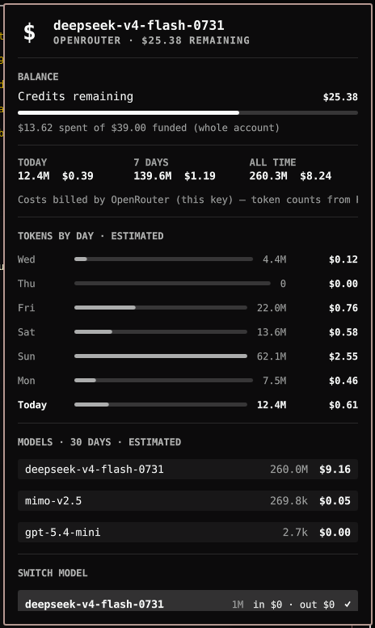

# Hermes OpenRouter

A Quickshell bar widget for the Omarchy shell that puts your OpenRouter
account, Hermes usage, and your model choice in one place: a `$` bar icon
with a dashboard panel.



- **Balance** — live remaining credits from `openrouter.ai`, with a
  spent-of-funded meter and a warning when fewer than 10% of funded credits
  are left.
- **Usage & costs** — tokens and spend for today, the last 7 days, and all
  time, plus a per-day breakdown (tokens **and** spend side by side) and
  per-model totals. Summary costs come from OpenRouter's own billing for
  this API key (`/auth/key`), so they match the activity monitor; the
  per-day and per-model breakdowns are Hermes' local estimates, labelled
  `ESTIMATED`. Token counts always come from Hermes' session store.
- **Model switcher** — a curated OpenRouter catalogue (deepseek, claude,
  gpt, gemini, grok, qwen, …) with per-1M pricing and context length. Pick
  one and it runs `hermes config set model.default <id>`; new Hermes sessions
  use it.

## Requirements

- Omarchy (Quattro shell) — the plugin is a `bar-widget` plugin
- `python3` (the data collector; standard library only — no pip packages)
- An OpenRouter API key in `OPENROUTER_API_KEY` (environment) or in
  `~/.hermes/.env` — used only to read the account balance and model catalogue

## Install

```sh
omarchy plugin add https://github.com/sradetzky/omarchy-hermes-openrouter.git --enable
```

The `$` icon lands in the right bar section, next to `omarchy.agents`.

## Usage

- **Left click** — open/close the panel
- **Middle click** — refresh now
- **Right click** — open the OpenRouter credits page
- In the panel: `←`/`→` move the model cursor, `Enter` applies it,
  `r` refreshes, `Esc`/`q` closes
- IPC: `omarchy-shell hermes.openrouter open|close|toggle|refresh`
  (or `omarchy-shell shell summon hermes.openrouter '{}'`)

The panel refreshes on load, on open, and every `refreshIntervalSec`
(default **300 s**).

## Data and permissions

- Reads Hermes' session database (`~/.hermes/state.db`, read-only) and your
  OpenRouter account via its public API.
- Writes state to `$XDG_STATE_HOME/hermes-openrouter/` and an
  `omarchy.agents`-compatible usage record to
  `$XDG_STATE_HOME/omarchy/agents/usage/hermes.json`.
- Changes your configuration **only** when you click a model in the panel:
  it sets `model.default` in your Hermes config (`hermes config set
  model.default <id>`). No install-time or background configuration writes.
- The OpenRouter model catalogue is fetched at most once every 24 h and
  cached on disk. No data leaves your machine except API calls to
  `openrouter.ai`.

## Configure

```sh
omarchy bar move hermes.openrouter --section right
omarchy bar set hermes.openrouter refreshIntervalSec 600 --json
```

### Optional: Hermes tab in the built-in Agents panel

The collector also writes an agent-usage record, so the built-in
`omarchy.agents` dashboard can show Hermes as an extra tab. Opt in by adding
`"hermes": { "enabled": true }` to that widget's `providers` setting in
`~/.config/omarchy/shell.json`.

## Remove

```sh
omarchy plugin remove hermes.openrouter
```

## License

[MIT](LICENSE) © 2026 Sven Radetzky